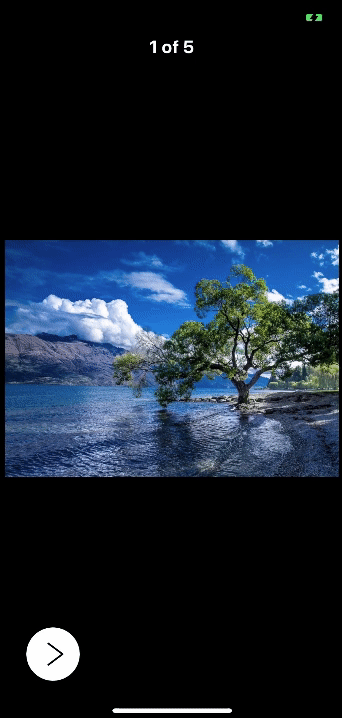

# ExpandableButton
[](https://developer.apple.com/swift/)
[](https://cocoapods.org/pods/ExpandableButton)
[](LICENSE)



## Requirements
- iOS 9.0+

## Installation
### [CocoaPods](http://www.cocoapods.org):
- Add the following line to your [`Podfile`](http://guides.cocoapods.org/using/the-podfile.html):
``` ruby
pod 'ExpandableButton'
```
- Add `use_frameworks!` to your [`Podfile`](http://guides.cocoapods.org/using/the-podfile.html).
- Run `pod install`.
- Add to files:
``` swift
import ExpandableButton  
```

## Usage
You can init **ExpandableButton** with `frame` (default is `.zero`), `direction` (default is `.right`) and items (each item will be button). `direction` is opening direction. `items` is `[ExpandableButtonItem]` whiches contain information about future buttons.
Diretions example:
``` swift
let rightButton = ExpandableButtonView(frame: frame, direction: .right, items: items)
let leftButton = ExpandableButtonView(frame: frame, direction: .left, items: items)
let upButton = ExpandableButtonView(frame: frame, direction: .up, items: items)
let downButton = ExpandableButtonView(frame: frame, direction: .down, items: items)
```


Items with `image` and `action`:
``` swift
// create items with images and actions
let items = [
    ExpandableButtonItem(
        image: UIImage(named: "delete"), 
        action: {_ in
            print("delete")
        }
    ),
    ExpandableButtonItem(
        image: UIImage(named: "edit"),
        action: {_ in
            print("edit")
        }
    ),
    ExpandableButtonItem(
        image: UIImage(named: "share"), 
        action: { _ in
           print("share")
        }
    )
]
             
// create ExpandableButton
let buttonView = ExpandableButtonView(items: items)
buttonView.frame = CGRect(x: 0, y: 0, width: 60, height: 60)
buttonView.backgroundColor = .white
view.addSubview(buttonView)
```


With `image`, `highlightedImage`, `imageEdgeInsets`:
``` swift
let insets = UIEdgeInsets(top: 16, left: 16, bottom: 16, right: 16)
        
// create items with image, highlighted image, image insets.        
let items = [
    ExpandableButtonItem(
        image: UIImage(named: "delete"),
        highlightedImage: UIImage(named: "highlightedDelete"),
        imageEdgeInsets: insets,
        action: {_ in
            print("delete")
        }
    )
    ...
]
```


`arrowWidth`, `separatorWidth` and `cornerRadius`:
``` swift
buttonView.arrowWidth = 2
buttonView.separatorWidth = 2
buttonView.layer.cornerRadius = 30
```


Custom icons for `open` and `close` actions, `closeOpenImagesInsets`: 
``` swift
// custom open and close images
buttonView.openImage = UIImage(named: "open")
buttonView.closeImage = UIImage(named: "close")
buttonView.closeOpenImagesInsets = insets
```


With `attributedTitle`, `highlightedAttributedTitle` and custom item `size`:
``` swift
// with attributed string, highlighted attributed string, custom size.
let items = [
    ExpandableButtonItem(
        attributedTitle: NSAttributedString(
            string: "Attributed Text",
            attributes: [.foregroundColor: UIColor.red]
        ),
        highlightedAttributedTitle: NSAttributedString(
            string: "Attributed Text",
            attributes: [.foregroundColor: UIColor.green]
        ),
        size: CGSize(width: 160, height: 60)
    )
]
```


With `attributedTitle` under `image` (using `contentEdgeInsets`, `titleEdgeInsets`, `imageEdgeInsets`, `titleAlignment`, `imageContentMode`, `size`):
``` swift 
let attributedTitle =  NSAttributedString(
    string: "Share",
    attributes: [.foregroundColor: UIColor.black,
                 .font: UIFont.systemFont(ofSize: 12)]
)

let highlightedAttributedTitle =  NSAttributedString(
    string: "Share",
    attributes: [.foregroundColor: UIColor.lightGray,
                 .font: UIFont.systemFont(ofSize: 12)]
)

let items = [
    ExpandableButtonItem(
        image: UIImage(named: "share"),
        highlightedImage: UIImage(named: "haglightedShare"),
        attributedTitle: attributedTitle,
        highlightedAttributedTitle: highlightedAttributedTitle,
        contentEdgeInsets: UIEdgeInsets(top: 6, left: 6, bottom: 6, right: 6),
        titleEdgeInsets: UIEdgeInsets(top: 24, left: -200, bottom: 0, right: 0),
        imageEdgeInsets: UIEdgeInsets(top: 6, left: 0, bottom: 24, right: 0),
        size: CGSize(width: 80, height: 60),
        titleAlignment: .center,
        imageContentMode: .scaleAspectFit
    )
]
```


You can also `open()` and `close()`:
``` swift
let buttonView = ExpandableButtonView(items: items)

buttonView.open() 
buttonView.close()
```

## All options
### [`ExpandableButtonView`](ExpandableButton/ExpandableButtonView.swift)
| Name                    | Type           | Default value                            | Description                                     |
| :---                    | :---           | :---                                     | :---                                            |
| `direction`             | `Direction`    | `.right`                                 | Opening direction. Could be `.left`, `.right`, `.up`, `.down`. Set only on `init(frame:direction:items:)`.
| `state`                 | `State`        | `.closed`                                | Current state. Could be `.opened`, `.closed` or `.animating`. |
| `animationDuration`     | `TimeInterval` | `0.2`                                    | Opening, closing and arrow animation duration.  | 
| `closeOnAction`         | `Bool`         | `false`                                  | If `true` call `close()` after any item action. |
| `isHapticFeedback`      | `Bool`         | `true`                                   | Turn on haptic feedback (Taptic engine)         |
| `arrowInsets`           | `UIEdgeInsets` | `top: 12 left: 12 bottom: 12 right: 12`  | Arrow insets.                                   |
| `arrowWidth`            | `CGFloat`      | `1`                                      | Arrow line width.                               |
| `arrowColor`            | `UIColor`      | `UIColor.black`                          | Arrow color.                                    |
| `closeOpenImagesInsets` | `UIEdgeInsets` | `.zero`                                  | Insets for custom close and open images.        |
| `closeImage`            | `UIImage?`     | `nil`                                    | Custom close image.                             |
| `openImage`             | `UIImage?`     | `nil`                                    | Custom open image.                              |
| `isSeparatorHidden`     | `Bool`         | `false`                                  | If `true` hide separator view.                  |
| `separatorColor`        | `UIColor`      | `UIColor.black`                          | Separator color.                                |
| `separatorInset`        | `CGFloat`      | `8`                                      | Separator inset from top, bottom for `.left`, `.right` directions and from left, right for `up`, `down`. |
| `separatorWidth`        | `CGFloat`      | `1`                                      | Separator view width.                           |

### [`ExpandableButtonItem`](ExpandableButton/ExpandableButtonItem.swift)
| Name                         | Type                             | Default value     | Description                                      |
| :---                         | :---                             | :---              | :---                                             |
| `image`                      | `UIImage?`                       | `nil`             | Image for `.normal` state.                       |
| `highlightedImage`           | `UIImage?`                       | `nil`             | Image for `.highlighted` state.                  | 
| `attributedTitle`            | `NSAttributedString?`            | `nil`             | Attributed string for `.normal` state.           |
| `highlightedAttributedTitle` | `NSAttributedString?`            | `nil`             | Attributed string for `.highlighted` state.      |
| `contentEdgeInsets`          | `UIEdgeInsets`                   | `.zero`           | `contentEdgeInsets` for `UIButton`               |
| `titleEdgeInsets`            | `UIEdgeInsets`                   | `.zero`           | `titleEdgeInsets` for `UIButton`.                |
| `imageEdgeInsets`            | `UIEdgeInsets`                   | `.zero`           | `imageEdgeInsets` for `UIButton`.                |
| `size`                       | `CGSize?`                        | `nil`             | `UIButton` size for current item. If `nil` will be equal to arrow button size. |
| `titleAlignment`             | `NSTextAlignment`                | `.center`         | `titleAlignment` for `titleLabel` in `UIButton`. |
| `imageContentMode`           | `UIViewContentMode`              | `.scaleAspectFit` | `imageContentMode` for `imageView` in `UIButton`.|
| `action`                     | `(ExpandableButtonItem) -> Void` | `{_ in}`          | Action closure. Calls on `.touchUpInside`        |
| `identifier`                 | `String`                         | `""`              | Identifier for `ExpandableButtonItem`.           |


You can also use [`ArrowButton`](ExpandableButton/ArrowButton.swift) (button which can drow left, right, up and down arrows using core graphics, just call `showLeftArrow()`, `showRightArrow()`, `showUpArrow()` or `showDownArrow()`) and [`ActionButton`](ExpandableButton/ActionButton.swift) (simple `UIButton` but with `actionBlock` propertie which calls on `.touchUpInside`) in your projects.

## License
**ExpandableButton** is under MIT license. See the [LICENSE](LICENSE) file for more info.
